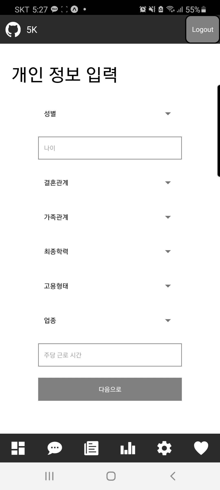
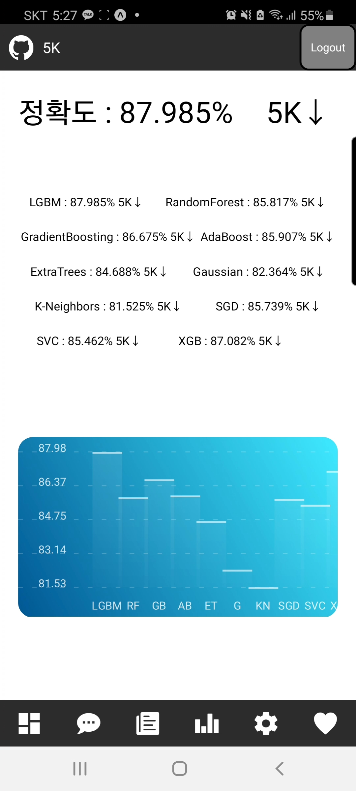
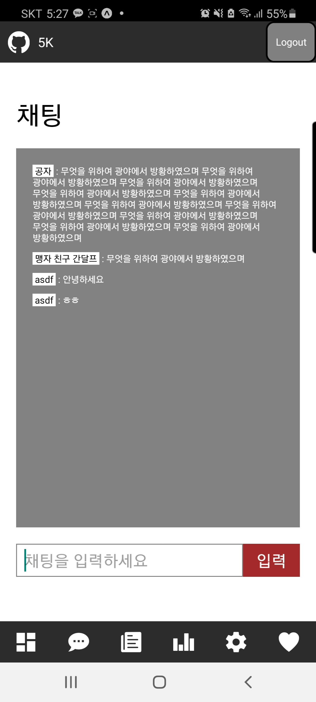
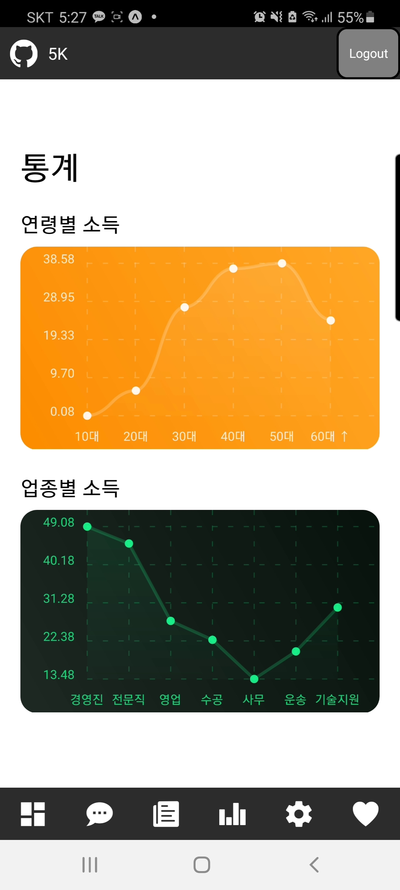
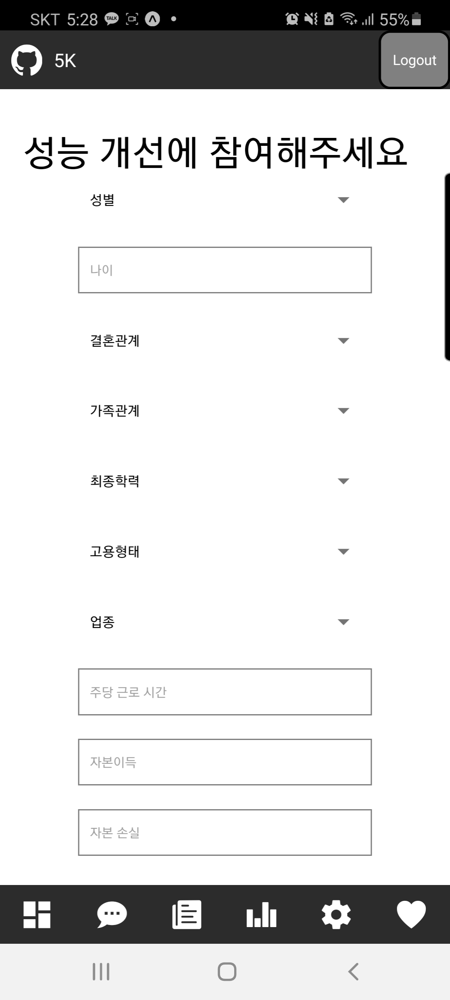
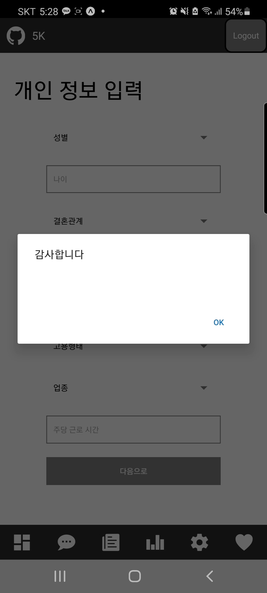

# 5K

### 딥러닝을 활용한 연봉 예측 어플리케이션   

## 서비스 목적   

* 간단한 인적사항을 갖고 자신의 예상 연봉을 확인    
* 현재 상태에서 어떤 부분을 바꾸면 연봉이 올라갈수 있는지 확인  

## 핵심기능

#### 연봉예측 
* 간단한 인적사항을 통해 87%의 높은 정확도로 연봉을 예측    
* 비슷한 나이나 업무에 속한 사람들의 평균수치를 그래프로 쉽게 확인  

#### 데이터 보관 및 관리
* 추가로 입력된 데이터를 확보한 후 성능 개선에 활용 
* token을 활용해 인증된 사용자만 데이터에 접근 가능하며 기밀성 보장 

## 프로젝트 사용법 
    5K-8dac8e3c07d24e058acef31faef48173-signed.apk
위의 앱을 다운받아 실행시킨다.  
ios도 지원 가능하나 따로 설치파일을 생성하지는 않았음.
## 프로젝트 사용법 (코드확인)

### import
    git clone https://lab.ssafy.com/s03-final/s03p31a510.git
    
### react-native (Front-end)
    yarn install
    yarn start
웹페이지가 열리며 QR코드가 나오는데 스마트폰에서 Expo앱 설치후  
해당 앱을 통해 앱 접속 가능

### Django (Back-end)
    python manage.py makemigrations
    python manage.py migrate
    python manage.py runserver
로컬에서 백서버에 접속하고 싶으면   
위와 같은 명령어를 통해 db생성후 서버를 실행한다.

## 서비스 설명  

</img>   
###### 메인 페이지로 간단한 인적사항을 기입하면 나의 연봉을 예측해볼수 있다.   

</img>   
###### 예측 결과 페이지로 다양한 알고리즘을 통해 예측된 결과를 보여주며 정확도까지 확인할수 있다.    

</img>   
###### 채팅기능이 구현되어있는데 다양한 기술을 사용해보고 싶어서 개발해봤다.    

</img>   
###### 자신과 비슷한 나이대나 업종에서 근무하는 사람들의 평균 통계를 확인할수 있다.     

</img>   
###### 모델의 정확도 향상을 위해 추가데이터를 확보하기 위한 기능이다.   

</img>   
###### 데이터를 제공해주셔서 감사합니다.    

